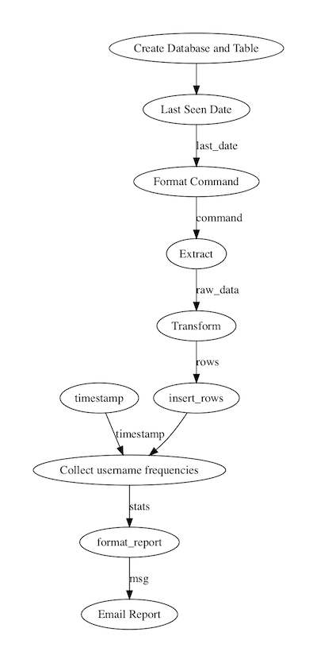

# ssh-etl-monitoring

This repo provides a fully realized [Prefect](https://github.com/PrefectHQ/prefect) Flow for monitoring all invalid SSH attempts on an Ubuntu server.

### monitoring_etl_flow.py

This flow runs every two hours, and collects information on all invalid SSH attempts in a local SQLite3 database.  Every 24 hours, an e-mail report of the top attempted usernames is sent out.

Here is a visualization of the dependency structure of all of the tasks (labeled edges represent the passage of data):

